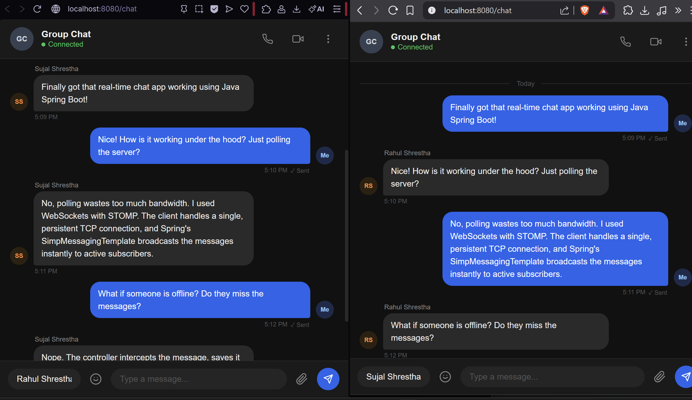

# 💬 Real-Time Chat Application

A real-time group chat web application built with **Spring Boot**, **WebSocket (STOMP)**, and **SockJS** — featuring a sleek dark-mode UI with live message delivery, colored user avatars, and smooth animations.



---

## ✨ Features

- **Real-time messaging** via WebSocket + STOMP protocol
- **SockJS fallback** for environments without native WebSocket support
- **Dark mode UI** with a clean, modern design
- **Color-coded avatars** — each participant gets a unique color
- **Animated message bubbles** with sender name, timestamp, and read receipts
- **Auto-reconnect** with a 3-second retry delay on disconnect
- **Redirect** from `/` to `/chat` automatically

---

## 🛠️ Tech Stack

| Layer | Technology |
|---|---|
| Backend | Spring Boot 3.2.5, Java 21 |
| WebSocket | Spring WebSocket + STOMP |
| Frontend | HTML, CSS, Vanilla JS |
| Template Engine | Thymeleaf |
| Build Tool | Maven |
| Utilities | Lombok |

---

## 📁 Project Structure

```
ChatApplication/
├── src/
│   └── main/
│       ├── java/com/app/ChatApplication/
│       │   ├── config/
│       │   │   └── WebSocketConfig.java      # STOMP + SockJS configuration
│       │   ├── controller/
│       │   │   └── ChatController.java       # Message handler + routing
│       │   ├── model/
│       │   │   └── ChatMessage.java          # Message model (Lombok)
│       │   └── ChatApplication.java          # Spring Boot entry point
│       └── resources/
│           ├── templates/
│           │   └── chat.html                 # Frontend UI
│           └── application.properties
├── Screenshot/
│   └── demo.png
└── pom.xml
```

---

## 🚀 Getting Started

### Prerequisites

- Java 21+
- Maven 3.6+

### Run Locally

```bash
# Clone the repository
git clone https://github.com/your-username/ChatApplication.git
cd ChatApplication

# Build and run
./mvnw spring-boot:run
```

Then open your browser and go to:

```
http://localhost:8080
```

You'll be redirected to `/chat` automatically.

---

## 💡 How It Works

1. The client connects to the WebSocket endpoint `/ws` using SockJS.
2. Once connected, it subscribes to `/topic/messages` to receive broadcasted messages.
3. When a user sends a message, it's published to `/app/sendMessage`.
4. The `ChatController` receives it via `@MessageMapping` and broadcasts it to all subscribers via `@SendTo("/topic/messages")`.

```
Browser → SockJS → /ws → STOMP → /app/sendMessage → ChatController → /topic/messages → All Clients
```

---

## 📡 WebSocket Configuration

| Setting | Value |
|---|---|
| Endpoint | `/ws` |
| Broker prefix | `/topic` |
| App destination prefix | `/app` |
| Allowed origins | `*` |

---

## 🎨 UI Highlights

- Fully responsive dark-themed layout
- Messages aligned left (others) and right (you)
- Unique color per user derived from their name
- Smooth fade-up animation on new messages
- Toast notifications for connection errors
- Enter key support for sending messages

---

## 📦 Dependencies

```xml
spring-boot-starter-web
spring-boot-starter-thymeleaf
spring-boot-starter-websocket
lombok
```

Frontend libraries loaded via CDN:
- [SockJS Client](https://cdn.jsdelivr.net/npm/sockjs-client@1.6.1/dist/sockjs.min.js)
- [STOMP.js](https://cdn.jsdelivr.net/npm/@stomp/stompjs@7.0.0/bundles/stomp.umd.min.js)

---

## 🤝 Contributing

Pull requests are welcome! For major changes, please open an issue first to discuss what you'd like to change.

---

## 📄 License

This project is open source and available under the [MIT License](LICENSE).
